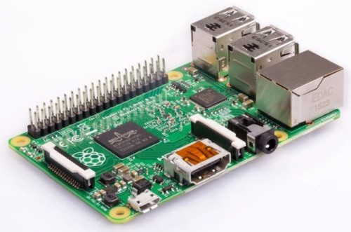

# HARDWARE SETUP

In this section we describe hardware used, links to other pages can change in time, attached (where feasible) are photos.

## Arduino Pro Mini 

Image (ArduinoProMini.jpg) source [arduino official shop](https://store.arduino.cc/arduino-pro-mini) where it is already retired, however e-bay and aliexpress have lot of them.

Main reason to select this board is the 3.3V option. This makes it very easy to work with NRF24L01 modules and also makes solar powering much easier.

## NRF24L01

Image (NRF24L01.jpg) source [Aliexpress RoarKit Store](https://www.aliexpress.com/item/1876127742.html?spm=a2g0o.productlist.0.0.612f1172yQQrww&algo_pvid=2ef89d1a-da30-4de0-9570-201ced200386&algo_expid=2ef89d1a-da30-4de0-9570-201ced200386-6&btsid=0bb0624516006323344971560edc14&ws_ab_test=searchweb0_0,searchweb201602_,searchweb201603_), but just open aliexpress and type NRF24L01 in search window.

This module was selected because of low power usage, fast and reliable communication (even with in-built antenna), cheap price, 3.3V power and easy integration in linux and also arduino.

It was tested in a 2 floor house with 0.5m thick walls, the receiver was close to one edge wall. and we can comfortably cover 20m radius without external antenna. If you want to increase range also modules with antenna are available. First I recommend to try the module on server, during my testing I have seen several modules with antenna and some of them have generated incoming traffic flood. Currently there is no protection against this behavior as I have evaluated these modules as not trustworthy and do not want to use them.

## Raspberry PI 2B

Image (RaspberryPi.jpg) source [Raspberry PI web](https://www.raspberrypi.org/products/raspberry-pi-2-model-b/)

This server was selected because I had it laying around. In general any linux server with GPIO can be used. To run OpenHAB this is sub-optimal, but working.
Be aware that server selection has impact on timing of 433 communication, this is extremelly critical and because of this the server SW requires elevated privileges to ensure delays are of defined length. If you change the server HW there is risk that you will need to change the timing.

## Radio module 433 TX

Radio module is used to communicate with Livolo switches, you need only TX module as Livolo can not answer. There are many modules available, best is to search for actual offer. If possilbe use module with antenna. In case small wire wound antenna is used and you buy both modules the TX antenna is the shorter one (and TX module is the smaller one). Preferred module is Superheterodyne.
Radio 433 can be source of noise in 433 band, because of this there is option to use gpio to turn the radio on or off, GPIO is 5V but 433 modules are 3.3 V because of this connect via transistor or mosfet to 3.3 V pin. I have used 2N3904 with 4k7 base resistor, but basically any combination is ok as the transistor works only as switch.

## Relay board

Depending on number of jalousie to drive you select appropriate board. One arduino can control maximum 65280 relays. If you use max 4 jalousies (=8 relays) for one arduino, it is recommended to use direct driven boards as on photo (compatible with uPower version). should you drive more jalousie/relays/switches it is recommended to use shift registers (google for terms like: "shift register", "IO expander", "Relay Expander", "IO Extender")

## Power

In actual version arduino is powered by any PSU you might find ofering 5V. I have made good experience with HiLink. Power needed is calculated like this:

- Arduino itself uses < 20mA in peak, normally 2uA to 10mA
- Relays use ~80mA (coil driven, can vary depending on model) per relay, for one jalousie 2 relays are needed, totaling 160mA when operating (calculate 200mA, to have safety margin)
- Sensors usage depending on datasheets and design

## Light sensor

Ligt is sensed with Light dependent resistor LDR NSL19M51 [farnell link](https://uk.farnell.com/advanced-photonix/nsl-19m51/light-dependent-resistor-550nm/dp/3168335) from ADVANCED PHOTONIX, this LDR creates together with resistor voltage divider and by measuring voltage on divider we got light intensity. Use resistance from 10M to 3K, dpending on what sensitivity spectrum you want to use and your power version. The lower resistance the higher power consumption, faster measure, better sensitivity in high light levels. The higher the resistance the lower power consumption, slower measure, better sensitivity in low light levels.
If you use any other resistor you need to calculate second resistor for voltage divider on your own.

Weather-proofing of the LDR is problematic and calculate that you will need to replace it from time to time.

## Transistors, resistors, cases, cables...

Use what you have, here it is assumed you know what you are doing and use appropriate gauge and secure distances.

If you are building SUPERCAP version be aware that selection of capacitors significantly impact autonomy time as ESD current of elyt can be higher than total arduino consumption. Same valid for regulators, diode reverse currents...

